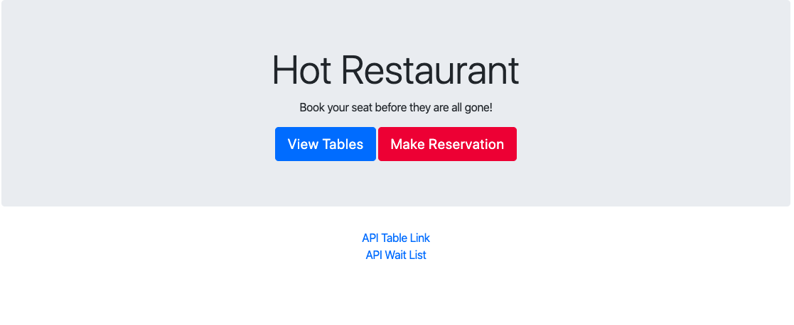

# Hot Restaurant

Restaurant scheduling app that helps schedule reservation requests. The restaurant has only 5 tables available, so first five requests get a reservation and every request after that is sent to the waiting list. Built with Node and Express with jQuery.



## Deployed Link

[See Live Site](https://hot-restaurant-ry.herokuapp.com/)

## Technologies Used

* [HTML](https://developer.mozilla.org/en-US/docs/Web/HTML): used for structuring and creating elements on the DOM
* [Bootstrap](https://getbootstrap.com/): open source toolkit for HTML, CSS, and JS
* [JavaScript](https://developer.mozilla.org/en-US/docs/Web/JavaScript): used to create responsive, interactive elements on the page
* [jquery](https://jquery.com/): JavaScript library to simplify HTML DOM traversal
* [Node.js](https://developer.mozilla.org/en-US/docs/Web/API/Node): JavaScript runtime, allows users to run JavaScript on the server
* [Express](https://expressjs.com/): Web framwork for Node.js

## Code snippet 
```
app.post("/api/tables/new", function(req, res){
    var newTable = req.body;
    if(tables.length < 5){
        tables.push(newTable)
    }
    else{
        waitlist.push(newTable)
    }
    res.json(newTable)
});
```

This POST route was used to push the new reservation either into the tables or the waitlist array, depending on weather the tables list was full (5). 


## Authors

**Rachel Yeung**
* [Portfolio](https://rachelyeung.herokuapp.com/)
* [Github](https://github.com/xrachhel)
* [LinkedIn](https://www.linkedin.com/in/rachel-yeung-814986159/)

